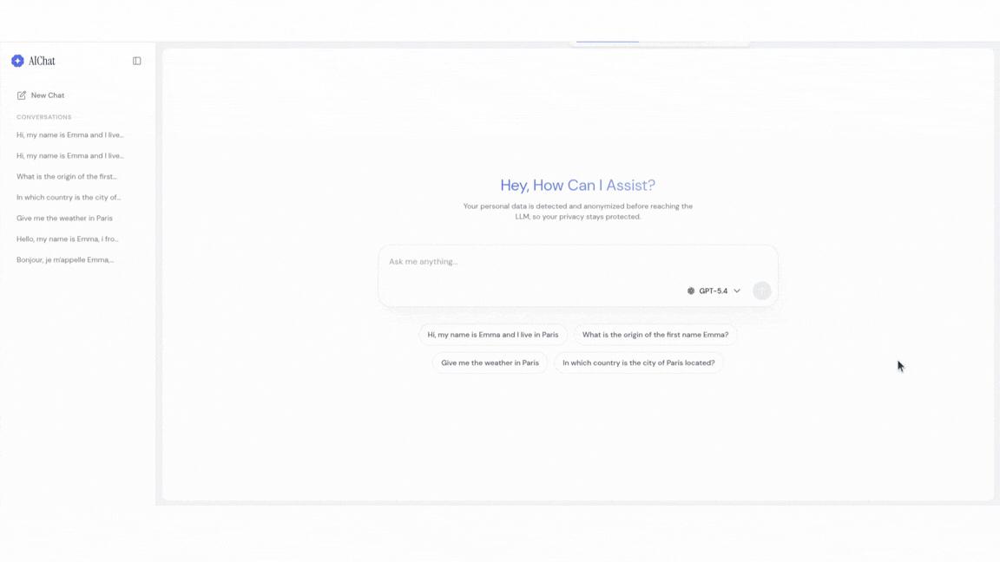
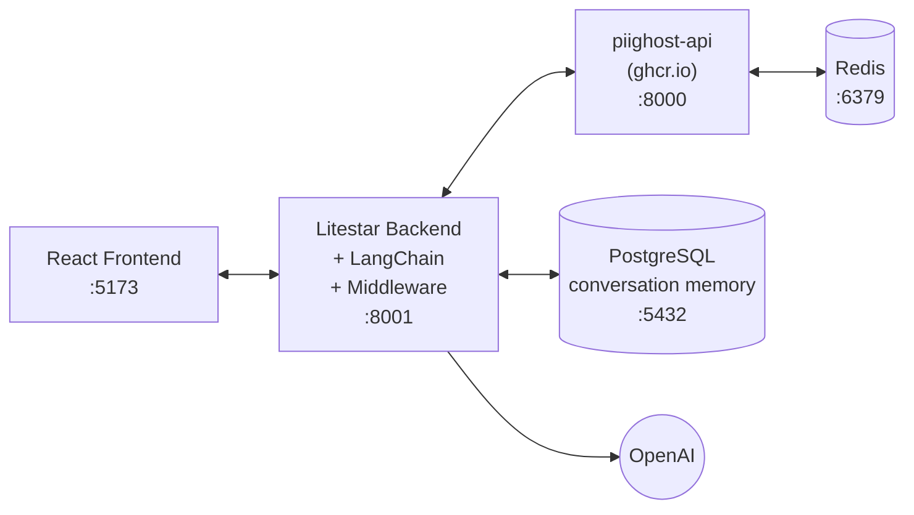

# PIIGhost Chat


[](https://docs.astral.sh/uv/)
[](https://docs.astral.sh/ruff/)

A demo chat application that shows how to build a **privacy-preserving AI chatbot** using [piighost](https://github.com/Athroniaeth/piighost) and [piighost-api](https://github.com/Athroniaeth/piighost-api). User messages are anonymized before reaching the LLM — personal information is replaced with placeholders, and responses are deanonymized transparently.



## What this demonstrates

- **[piighost](https://github.com/Athroniaeth/piighost)** — PII anonymization library with regex detectors + optional NER (GLiNER2, spaCy, transformers)
  - `PIIAnonymizationMiddleware` wrapping a LangChain agent (anonymize before LLM, deanonymize after)
  - `PIIGhostClient` for calling piighost-api over HTTP
- **[piighost-api](https://github.com/Athroniaeth/piighost-api)** — REST API server for PII anonymization inference
  - Entity detection and highlighting in the chat UI
  - Thread-scoped conversation memory for consistent placeholders
- **[keyshield](https://github.com/Athroniaeth/keyshield)** — API key authentication with Argon2 hashing
- **LangChain `create_agent`** with tool use (`send_email`, `get_weather`) — the LLM sees anonymized text but tools receive real values via middleware

## Architecture



### User flow

1. User types a message in the chat
2. Backend calls piighost-api to detect PII → frontend highlights detected entities (names, locations, etc.)
3. User validates → message is sent to the LangChain agent
4. The `PIIAnonymizationMiddleware` anonymizes the message before the LLM sees it
5. LLM responds (with placeholders like `<<PERSON_1>>`) — streamed to the frontend via SSE
6. Middleware deanonymizes the response — frontend refreshes to show real values

## Quick start

### 1. Configure environment

```bash
cp .env.example .env
```

Edit `.env` with your values:

```env
# Required: your OpenAI API key
OPENAI_API_KEY=sk-...

# Optional: secure piighost-api with keyshield authentication
SECRET_PEPPER=
PIIGHOST_API_KEY=
```

### 2. Generate API keys (optional)

Use [keyshield](https://github.com/Athroniaeth/keyshield) to secure the piighost-api service:

```bash
# Generate a random pepper
uv run keyshield pepper
# → RIaATn4KmHzlZdxSExsZWRSmNE9EzC87

# Generate a hashed API key using that pepper
uv run keyshield hash RIaATn4KmHzlZdxSExsZWRSmNE9EzC87
# → Outputs a hashed key + raw API key (ak_v1-...)
```

Copy the pepper and the raw API key into your `.env`:

```env
SECRET_PEPPER=RIaATn4KmHzlZdxSExsZWRSmNE9EzC87
PIIGHOST_API_KEY=ak_v1-xxxxxxxx-xxxxxxxxxxxxxxxxxxxxxxxxxxxxxxxx
```

> If both values are left empty, piighost-api starts with authentication **disabled** (development mode).

### 3. Start with Docker Compose

```bash
make docker-build   # first time (builds images)
make docker-up      # subsequent starts (no rebuild)
```

This starts 5 services:

| Service | Port | Description |
|---------|------|-------------|
| `frontend` | [localhost:5173](http://localhost:5173) | React + Tailwind chat UI |
| `backend` | [localhost:8001](http://localhost:8001) | Litestar API + LangChain agent |
| `piighost-api` | 8000 (internal) | PII anonymization inference server |
| `redis` | 6379 (internal) | Cache for piighost-api |
| `postgres` | 5432 | LangGraph conversation checkpointer |

### 4. Open the chat

Go to [http://localhost:5173](http://localhost:5173) and try:

```
Bonjour, je m'appelle Patrick et j'habite à Paris.
```

You should see "Patrick" and "Paris" highlighted as detected PII entities. Validate to send the anonymized message to the LLM.

## Pipeline configuration

The `pipeline.py` file at the project root configures the PII detection pipeline for piighost-api. This project uses GLiNER2 for semantic NER (installed via `EXTRA_PACKAGES=piighost[gliner2]` in compose) combined with regex detectors for common, EU, and US patterns.

Edit this file to add or remove detectors, adjust thresholds, or change labels.

## Project structure

```
piighost-chat/
├── backend/                  # Litestar API (Python)
│   ├── src/piighost_chat/
│   │   ├── app.py            # App factory, agent, routes
│   │   ├── schemas.py        # msgspec request/response models
│   │   └── cli.py            # CLI entrypoint
│   ├── pyproject.toml
│   └── Dockerfile
├── frontend/                 # React + Tailwind CSS (TypeScript)
│   ├── src/
│   │   ├── pages/            # Home page
│   │   ├── components/       # Chat UI components
│   │   └── services/api.ts   # Backend API client
│   ├── package.json
│   └── Dockerfile
├── pipeline.py               # PII detection config (mounted in piighost-api)
├── compose.yml               # App services (frontend + backend)
├── compose.infra.yml         # Infrastructure (piighost-api, redis, postgres)
├── .env.example
└── Makefile
```

## Development

```bash
make lint            # Format + lint + type-check (backend)
make test            # Run backend tests
make docker-up       # Start all services (detached)
make docker-down     # Stop all services
```